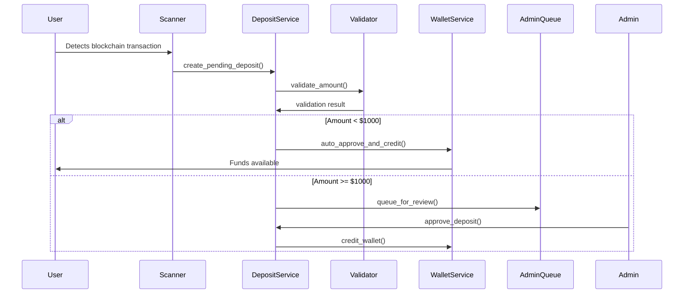

# Business Logic Analysis Template

This template provides a structured format for documenting extracted business logic from Python codebases.

---

# Business Logic Analysis: [System/Module Name]

**Analysis Date**: [Date]  
**Analyzer**: [Name]  
**Scope**: [Full codebase | Specific modules | Feature area]  
**Codebase Version**: [Commit hash or version number]

## Executive Summary

**Purpose**: Brief 2-3 sentence overview of what this system does from a business perspective.

**Key Business Capabilities**:
- Capability 1: Brief description
- Capability 2: Brief description  
- Capability 3: Brief description

**Critical Findings**:
- Finding 1: Key insight about architecture, coupling, or business logic distribution
- Finding 2: Major recommendation or concern
- Finding 3: Notable pattern or anti-pattern discovered

---

## Domain Model

### Core Entities

Document the primary business entities and their relationships.

#### [Entity Name 1] (e.g., Order, User, Transaction)

**Purpose**: What this entity represents in the business domain

**Key Attributes**:
- `attribute_name` (type): Business meaning
- `attribute_name` (type): Business meaning

**Business Methods**:
- `method_name()`: What business logic it encapsulates
- `method_name()`: What business logic it encapsulates

**State Transitions** (if applicable):
```
PENDING → APPROVED → PROCESSING → COMPLETED
         ↓
      REJECTED
```

**Relationships**:
- Has many [Entity2]
- Belongs to [Entity3]

**File Location**: `path/to/entity.py`

---

#### [Entity Name 2]

[Repeat structure above]

---

### Value Objects

Document immutable domain concepts that don't have identity.

#### [Value Object Name] (e.g., Money, Address, DateRange)

**Purpose**: What it represents

**Key Properties**:
- Property 1
- Property 2

**Validation Rules**:
- Rule 1
- Rule 2

**File Location**: `path/to/value_object.py`

---

### Domain Events

Document significant business occurrences that trigger actions.

#### [Event Name] (e.g., DepositReceived, OrderCancelled)

**Trigger**: What business action causes this event

**Payload**:
- Data 1
- Data 2

**Handlers**: What business logic responds to this event

**File Location**: `path/to/event.py`

---

## Business Logic Inventory

### By Business Capability

Organize extracted logic by what business capability it supports.

#### Capability 1: [Name] (e.g., Payment Processing)

**Description**: What business capability this represents

**Core Logic Components**:

##### Component: [Service/Class Name]
**File**: `path/to/file.py`  
**Lines**: [Start-End]  
**Type**: [Service Layer | Domain Model | Workflow | Validator]

**Signature**:
```python
def process_payment(
    order_id: str, 
    payment_method: str, 
    amount: Decimal
) -> PaymentResult:
```

**Business Rules Implemented**:
1. **Minimum payment validation**: Payment amount must be >= $1.00
2. **Payment method verification**: Verify payment method is active and not expired
3. **Fraud check**: Amounts > $10,000 require additional verification
4. **Idempotency**: Duplicate payment requests within 5 minutes are rejected

**Decision Points**:
```python
if amount > 10000:
    # Rule: Large payments need fraud review
    return await_fraud_review()
elif payment_method.is_expired():
    # Rule: Can't use expired payment methods
    raise PaymentMethodExpired()
```

**Data Flow**:
Input: Order ID, payment method, amount  
→ Validate payment method  
→ Check fraud rules  
→ Process payment  
→ Update order status  
Output: Payment result (success/failure)

**Dependencies**:
- Calls: `FraudService.check_transaction()`
- Calls: `OrderRepository.update_status()`
- Calls: `PaymentGateway.charge()`

**Infrastructure Coupling**:
- ⚠️ Directly calls external payment gateway API (consider abstracting)
- ✅ Uses repository pattern for data access

---

##### Component: [Next Component]
[Repeat structure above]

---

#### Capability 2: [Name]
[Repeat structure above]

---

### By Pattern Type

Alternative organization showing which architectural patterns are used.

#### Service Layer Components

| Component | Capability | File | Key Business Rules |
|-----------|-----------|------|-------------------|
| DepositService | Deposit Processing | deposits/service.py | Auto-approve < $1000, KYC required |
| WithdrawalService | Withdrawals | withdrawals/service.py | Daily limit $10k, 3 confirmations |

#### Domain Model Components

| Entity | Business Methods | File | State Transitions |
|--------|------------------|------|------------------|
| Order | calculate_total(), can_cancel() | orders/model.py | PENDING→PROCESSING→COMPLETED |
| Wallet | credit(), debit() | wallets/model.py | N/A |

#### Workflow Components

| Workflow | States | File | Triggers |
|----------|--------|------|----------|
| WithdrawalWorkflow | 5 states | workflows/withdrawal.py | User request, admin approval |

---

## Key Business Workflows

Document multi-step business processes that span multiple components.

### Workflow 1: [Name] (e.g., "User Deposit Flow")

**Business Purpose**: What business outcome this workflow achieves

**Trigger**: What initiates this workflow

**Actors**: Who/what participates
- User
- System
- Admin (if approval needed)

**Sequence**:



**Steps**:

1. **Blockchain Detection** (`scanner/detector.py:45-67`)
   - Business rule: 6 confirmations required for BTC
   - Calls: `BlockchainClient.get_transaction()`

2. **Deposit Creation** (`deposits/service.py:89-120`)
   - Business rule: All deposits start as PENDING
   - Business rule: Minimum $10 deposit
   - Calls: `DepositRepository.create()`

3. **Auto-Approval Check** (`deposits/service.py:145-167`)
   - Business rule: Deposits < $1000 auto-approved
   - Business rule: User must be KYC verified
   - Decision: Auto-approve or queue for manual review

4. **Wallet Crediting** (`wallets/service.py:78-95`)
   - Business rule: Atomic balance update
   - Business rule: Audit trail required
   - Calls: `WalletRepository.update_balance()`

5. **Notification** (`notifications/service.py:34-45`)
   - Business rule: Notify user of deposit status
   - Sends email and in-app notification

**Business Rules Summary**:
- 6 blockchain confirmations required
- Minimum deposit: $10
- Auto-approve threshold: $1000
- KYC verification required
- Atomic balance updates

**Alternative Flows**:
- **Insufficient funds**: [Description]
- **KYC not verified**: [Description]
- **Duplicate detection**: [Description]

**Related Files**:
- `scanner/detector.py`
- `deposits/service.py`
- `wallets/service.py`
- `notifications/service.py`

---

### Workflow 2: [Name]
[Repeat structure above]

---

## Business Rules Catalog

Centralized list of all discovered business rules.

### Validation Rules

| Rule ID | Description | Enforced In | Impact |
|---------|-------------|-------------|--------|
| VAL-001 | Minimum deposit $10 | DepositService.validate() | Rejects deposits |
| VAL-002 | Maximum withdrawal $50k per transaction | WithdrawalService.validate() | Requires multiple transactions |
| VAL-003 | Email format validation | UserValidator.validate_email() | Rejects registration |

### Business Logic Rules

| Rule ID | Description | Implemented In | Rationale |
|---------|-------------|----------------|-----------|
| BUS-001 | Auto-approve deposits < $1000 | DepositService.process() | Reduce manual review workload |
| BUS-002 | Daily withdrawal limit $10k | WithdrawalService.check_limits() | Fraud prevention |
| BUS-003 | 6 confirmations for BTC deposits | Scanner.validate_confirmations() | Security standard |

### Calculation Rules

| Rule ID | Description | Formula | Implemented In |
|---------|-------------|---------|----------------|
| CALC-001 | Trading fee calculation | 0.1% of transaction amount | TradingService.calculate_fee() |
| CALC-002 | Wallet balance aggregation | Sum of all currency balances in USD | WalletService.get_total_balance() |

### State Transition Rules

| Entity | From State | To State | Condition | Enforced In |
|--------|-----------|----------|-----------|-------------|
| Deposit | PENDING | APPROVED | Amount < $1000 | DepositService |
| Deposit | PENDING | REVIEW | Amount >= $1000 | DepositService |
| Order | PENDING | CANCELLED | User request + < 24 hours old | OrderService |

---

## Decision Points & Branching Logic

Document significant if/else, switch/case, or strategy pattern decision points.

### Decision Point 1: [Name]

**Location**: `path/to/file.py:lines`

**Business Context**: Why this decision exists

**Logic**:
```python
if deposit.amount < 1000:
    # AUTO-APPROVE PATH
    # Business reason: Reduce manual review burden
    return auto_approve(deposit)
elif deposit.amount >= 10000:
    # HIGH-VALUE PATH
    # Business reason: Extra scrutiny for large amounts
    return require_dual_approval(deposit)
else:
    # STANDARD REVIEW PATH
    # Business reason: Normal manual review process
    return queue_for_review(deposit)
```

**Outcomes**:
- Path 1: Auto-approved → Immediate wallet credit
- Path 2: Dual approval → Requires 2 admin approvals
- Path 3: Standard review → Single admin approval

**Related Rules**: VAL-001, BUS-001

---

### Decision Point 2: [Name]
[Repeat structure above]

---

## Infrastructure Coupling Analysis

Identify where business logic is entangled with infrastructure concerns.

### High Coupling Issues (🔴 Critical)

#### Issue 1: Business Logic in HTTP Handler

**Location**: `api/views/deposits.py:45-89`

**Problem**: Deposit approval logic embedded directly in API view function

**Current Code Pattern**:
```python
@app.route('/deposits/<id>/approve', methods=['POST'])
def approve_deposit(id):
    deposit = Deposit.objects.get(id=id)  # DB query
    if deposit.amount > 1000:  # Business rule
        return jsonify({'error': 'Requires dual approval'}), 403
    deposit.status = 'APPROVED'  # Business state change
    deposit.save()  # DB persistence
    return jsonify({'status': 'success'})
```

**Impact**: 
- Business logic can't be reused outside HTTP context
- Hard to unit test deposit approval rules
- Mixing concerns violates separation of concerns

**Recommendation**: Extract to `DepositService.approve()` method

**Effort**: Medium (2-4 hours)

---

#### Issue 2: [Next Coupling Issue]
[Repeat structure above]

---

### Medium Coupling Issues (🟡 Moderate)

[List and describe]

---

### Low Coupling Issues (🟢 Minor)

[List and describe]

---

## Recommendations

### Immediate Actions (High Priority)

1. **Decouple [Component] from [Infrastructure]**
   - Problem: [Description]
   - Impact: [Business or technical impact]
   - Solution: [Proposed approach]
   - Effort: [Time estimate]

2. **Extract [Business Logic] to Service Layer**
   - Problem: [Description]
   - Impact: [Business or technical impact]
   - Solution: [Proposed approach]
   - Effort: [Time estimate]

### Medium-term Improvements

[Similar structure]

### Long-term Refactoring

[Similar structure]

---

## Architecture Patterns Observed

### Positive Patterns ✅

- **Repository Pattern**: Well-implemented data access abstraction in `repositories/` directory
- **Service Layer**: Clear separation of business logic in `services/` directory
- **Domain Events**: Event-driven architecture for deposit notifications

### Anti-Patterns ⚠️

- **Anemic Domain Models**: Entity classes are just data containers (e.g., `Order` class)
- **God Objects**: `TransactionService` handles too many responsibilities (deposits, withdrawals, transfers)
- **Business Logic in Queries**: SQL queries contain business rules (e.g., status filtering)

---

## Testing Coverage Analysis

### Business Logic Test Coverage

| Component | Business Logic Methods | Unit Tested | Integration Tested | Coverage Notes |
|-----------|----------------------|-------------|-------------------|----------------|
| DepositService | 8 | 6 | 5 | Missing tests for edge cases |
| WithdrawalService | 12 | 12 | 8 | Good coverage |
| OrderService | 15 | 3 | 2 | ⚠️ Low test coverage |

### Untested Business Rules

Critical business rules lacking test coverage:

1. **Rule**: Auto-approval for deposits < $1000
   - **Component**: DepositService
   - **Risk**: High (automatic fund crediting)
   - **Recommendation**: Add unit + integration tests

2. **Rule**: Daily withdrawal limit enforcement
   - **Component**: WithdrawalService
   - **Risk**: High (fraud prevention)
   - **Recommendation**: Add comprehensive tests

---

## Appendix

### File Inventory

Complete list of files analyzed:

| File Path | Type | Lines | Business Logic | Infrastructure |
|-----------|------|-------|---------------|----------------|
| deposits/service.py | Service | 456 | 80% | 20% |
| wallets/service.py | Service | 234 | 90% | 10% |
| api/views/deposits.py | API Handler | 123 | 40% | 60% |

### Glossary

Business term definitions discovered in the codebase:

- **Sweep**: The process of consolidating funds from multiple wallets
- **Reconciliation**: Matching blockchain transactions to internal deposit records
- **Cold wallet**: Offline storage for cryptocurrency

### Related Documentation

Links to existing documentation:

- [API Documentation](link)
- [Database Schema](link)
- [Architecture Decisions](link)